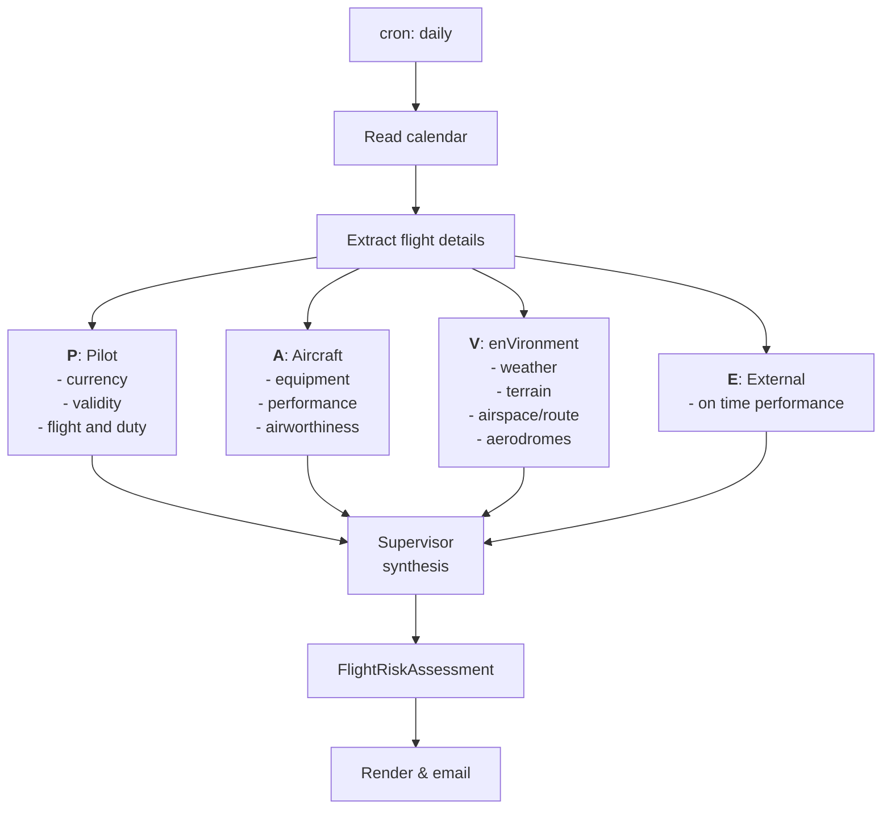

# PAVE — An Autonomous Preflight Briefing Agent

*An experiment in whether AI agents can handle the tedious half of preflight briefing and risk assessment—and give a pilot something worth reading.*


---

## What this is

The PAVE checklist — **P**ilot, **A**ircraft, en**V**ironment, and **E**xternal pressures — is a risk-assessment framework that helps pilots gather relevant information and focus on the details that matter. PAVE Agent uses this framework to provide pilots with accurate information to support decision-making and risk mitigation.

The synthesis itself isn’t intellectually difficult. It’s just tedious and spread across many different sources—which is exactly the kind of problem AI agents are supposed to handle well.

**So, this project runs on a schedule, detects a flight on my calendar, gathers scattered public data, analyzes it across the four PAVE domains, and emails me a briefing the night before I fly.** No prompting, and no dashboard to remember to open. It simply shows up.


```
Subject: [PAVE] KORD→KBOS 18:00Z — MODERATE (low ceilings, GDP risk)
```

## What this is *not*

**This is an educational project. Do not use it for operational flight
planning.**

It is not a replacement for official weather briefings, ForeFlight,
Leidos, or your own judgment. It is not certified, verified, or affiliated
with any aviation authority. It will sometimes be confidently wrong.

Three constraints follow from that, and they are built into the design:

- **It advises; it never decides.** The agent produces a risk *assessment*
  based on the factors it finds. It does not issue go/no-go recommendations.
  That authority belongs to the pilot in command, and this project does not
  pretend otherwise.
- **Every claim is traceable.** Each risk driver includes its source, so you
  can check the raw METAR or other underlying data instead of simply
  trusting a paraphrase.
- **It reports its own uncertainty.** When the agent cannot parse a flight
  or reach a data source, the briefing says so plainly instead of filling
  the gap with plausible-sounding fiction.

If aviation software has one cultural rule worth importing into AI, it is
this: a system that hides its own failure modes is more dangerous than one
that openly acknowledges them.

## Why I built it

I'm learning how to develop agents, and I wanted a problem with real
constraints rather than another chatbot wrapper. Aviation is an unusually
good fit: the data is public, the domain punishes vagueness, and there is a
genuine standard for correctness.


## How it works

Four specialist agents—one for each PAVE domain—investigate in parallel. A
supervisor then evaluates their findings, resolves conflicts, and produces
a structured assessment that is rendered as an email.



### How risk is assessed
#### Why not the typical 5x5 risk matrix?
The typical risk matrix used in airline operations is based on the
ICAO/FAA 5×5 grid: severity (*Catastrophic* to *Negligible*) against
likelihood (*Frequent* to *Extremely Improbable*), with each cell mapped to
an *Intolerable*, *Tolerable*, or *Acceptable* zone. It is designed for
organizational hazard management—for example, an airline deciding whether
its contaminated-runway procedures are adequate across ten thousand
flights. These are not questions we can honestly answer.

The FAA Safety Team publishes a Flight Risk Assessment Tool built directly
on the PAVE framework. The mechanism is refreshingly simple: answer
weighted questions, add up the points, compare the result against defined
thresholds, and assign a green, yellow, or red risk level. A FRAT is not a
go/no-go decision framework; it is a planning aid that helps operators
identify hazards. Operator-defined gates based on the elements of the PAVE
framework can support a more consistent and objective assessment.

More information about the FAA Safety Team's FRAT is available here:  
https://www.faa.gov/general/flight-risk-assessment-tool-frat-faa-safety-team

#### The scoring model

The system uses three mechanisms to help determine risk. In order of
authority:

##### 1. Hard gates

Scenarios or parameters that automatically produce a high-risk score.

##### 2. Weighted factors

Parameters that produce numeric values, which are later combined to
calculate an overall risk score.

##### 3. Interactions

Combinations of factors that produce a higher score than the factors would
receive when assessed individually.

##### Quality multiplier

The quality multiplier discounts scores when there is uncertainty about
whether a condition will occur. For example, a forecast of embedded
thunderstorms made 30 hours before departure may score lower than an
observed occurrence because the forecast may not verify. If the condition
does develop, the briefing can be rerun closer to departure and the risk
will receive its full weight.

#### Using news as a lead
A news report is not a fact about tomorrow's flight. It is a pointer to
something that needs further investigation. The news agent's real job is
query planning for the other agents. That is what makes the multi-agent
architecture genuinely load-bearing rather than decorative: one node changes
what the others go looking for.

```
news signal  →  hypothesis  →  authoritative lookup  →  scored fact
                     │
                     └─ (if no lookup exists) → advisory-only watch item
```

##### Raw news breaks the scoring model
**Coverage does not equal risk.** News outlets cover unusual events, not
necessarily frequent ones. An airport with a persistent, well-managed
hazard may generate no coverage, while a single novel event can generate
dozens of articles. The volume of coverage is therefore a poor proxy for
the underlying hazard rate.

**Attention scales with airport size.** KORD can generate more aviation news
in a week than KTTA generates in a decade. If raw coverage is scored
directly, the system will flag major hubs every night while overlooking
untowered airports where a pilot may face more relevant risks. This is the
most insidious problem because it produces confident-looking output that is
systematically distorted.

**One event can generate dozens of articles.** Naive counting can multiply
a single incident by its syndication footprint: one Reuters report, forty
regional newspaper articles, and three aggregator pages may all describe
the same event.

**Staleness matters.** A 2019 runway-incursion story that appears in a
search result is not necessarily relevant information about tomorrow's
flight.

**News is untrusted input.** Arbitrary web text is being passed to an LLM
that produces structured output consumed downstream. That creates a prompt
injection surface, and it is one that is easy to overlook.

This is where transparency plays a crucial role. The end user must be able
to distinguish between factors supported by evidence and factors that are
based on uncertainty, inference, or incomplete data.


### Supervision 

The supervisor reviews the completed, scored assessment and looks for
connections between factors that the additive model treated as independent.
It then writes the prose that a human actually reads.

### Learning & Feedback Policy

Nothing learns automatically. Feedback accumulates in versioned configuration,
and a human reviews and merges any changes.

Rules:

- **Tightening is easy; loosening is hard.** A single report saying,
  “This happened, and you didn’t warn me,” is enough to trigger a review.
  Downgrading a warning requires repeated, independent reports.
- **An ignored warning followed by a uneventful flight changes nothing.**
  The result is logged for review. Most conservative warnings will be
  unnecessary in individual cases; tuning them away is how safety margins
  erode.
- **The profile learns facts, not preferences.** It can learn hours in type,
  currency, and airports flown—but never what the pilot appears willing to
  tolerate.
- **Configuration changes are replayed against past briefings before they
  are merged**. This shows which risk bands would have changed.
- **Disagreements become permanent test cases.** The test suite only grows.

  


> ⚠️ **Educational project. Not for operational flight planning.** Always
> obtain an official weather briefing and exercise your own judgment as
> pilot in command.
