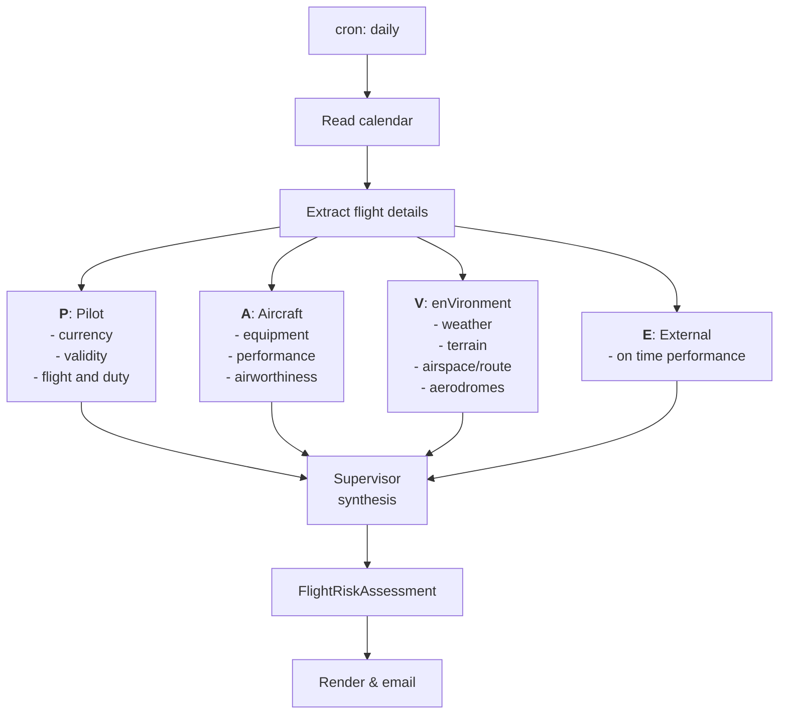

# PAVE — An Autonomous Preflight Briefing Agent

*An experiment in whether AI agents can do the tedious half of preflight
briefing and risk assessment — and hand a pilot something worth reading.*


---

## What this is

The PAVE checklist — **P**ilot, **A**ircraft, **e**n**V**ironment,
**E**xternal pressures — is a risk assessment framework to help pilots gather relevant information
and address the details that matter. Using this framework it is the aim 
that PAVE Agent provides crew with accurate information to assist in decision making 
and risk mitigation.

The synthesis isn't intellectually hard. It's just *tedious and
heterogeneous* — which is exactly the shape of problem AI agents are
supposed to be good at.

**So: this project runs on a schedule, notices a flight on my calendar,
gathers the scattered public data, reasons about it across the four PAVE
domains, and emails me a briefing the night before I fly.** No prompting,
no dashboard to remember to open. It shows up.

```
Subject: [PAVE] KORD→KBOS 18:00Z — MODERATE (low ceilings, GDP risk)
```

## What this is *not*

**This is an educational project. Do not use it for operational flight
planning.**

It is not a replacement for official weather briefings, ForeFlight,
Leidos, or your own judgment. It is not certified, not verified, and not
affiliated with any aviation authority. It will sometimes be confidently wrong.

Three constraints follow from that, and they're baked into the design:

- **It advises; it never decides.** The agent produces a risk *assessment*
  with the factors it found. It does not issue go/no-go calls. That
  authority belongs to the pilot in command and this project won't
  pretend to borrow it.
- **Every claim is traceable.** Each risk driver carries its source, so
  you can check the raw METAR rather than trusting a paraphrase.
- **It reports its own uncertainty.** When the agent can't parse a flight
  or can't reach a data source, the briefing says so plainly instead of
  filling the gap with plausible-sounding fiction.

If aviation software has one cultural rule worth importing into AI, it's
that a system which hides its own failure modes is more dangerous than
one that has none.

## Why I built it

I'm learning agent development, and I wanted a problem with real
constraints rather than another chatbot wrapper. Aviation is unusually
good for this: the data is public, the domain punishes vagueness, and
there's a genuine correctness standard.

This repo is the artifact of that learning. Alongside the code, the
[**Design decisions**](#design-decisions) section documents the tradeoffs
I made and, more usefully, the ones I got wrong first. The central one:
**the LLM handles judgment, and plain deterministic Python handles
everything else** — scheduling, fetching, formatting, delivery. That
boundary makes the system debuggable, and it's the lesson I'd keep if I
threw out all the rest.

## How it works

Four specialist agents — one per PAVE domain — investigate in parallel. A
supervisor weighs their findings, resolves conflicts, and produces a
structured assessment that gets rendered to email.



### How risk is assessed
#### Why not the typical 5x5 risk matrix?
The typical risk matrix used in airline operations is based on the ICAO/FAA 
5×5 grid — severity (Catastrophic→Negligible) against likelihood (Frequent→Extremely Improbable), 
giving cells mapped to Intolerable / Tolerable / Acceptable zones. It's built for organisational 
hazard management — an airline deciding whether contaminated-runway procedures are adequate across 
ten thousand flights. These are not questions we can honestly answer. 

The FAA Safety Team publishes a Flight Risk Assessment Tool built directly on PAVE. The mechanism 
is refreshingly simple: weighted questions, sum the points, compare against thresholds, 
get green/yellow/red. A FRAT is not a go/no-go decision framework - its a planning aid that
facilitates the operator in identifying hazards. Operator defined gates based on all elements of the 
PAVE framework make for an unbiased assessment. More about FRAT here: https://www.faa.gov/general/flight-risk-assessment-tool-frat-faa-safety-team

#### The scoring model


In progress . . .

> ⚠️ **Educational project. Not for operational flight planning.** Always
> obtain an official weather briefing and exercise your own judgment as
> pilot in command.
