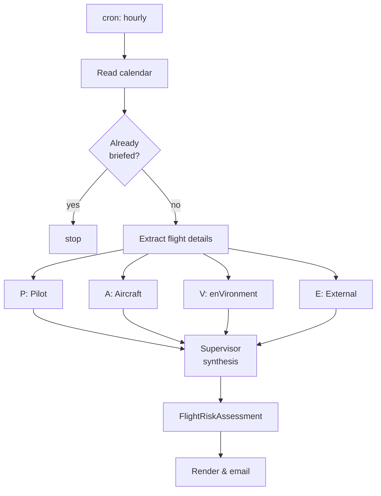

# PAVE Agent
An agentic flight risk assessment tool.

```mermaid
flowchart TD
    CRON[cron: hourly] --> CAL[Read calendar]
    CAL --> LEDGER{Already<br/>briefed?}
    LEDGER -->|yes| STOP[stop]
    LEDGER -->|no| EX[Extract flight details]

    EX --> P[P: Pilot<br/>]
    EX --> A[A: Aircraft<br/>]
    EX --> V[V: enVironment<br/>]
    EX --> E[E: External<br/>]

    P --> SUP[Supervisor<br/>synthesis]
    A --> SUP
    V --> SUP
    E --> SUP

    SUP --> ASSESS[FlightRiskAssessment]
    ASSESS --> MAIL[Render & email]
```
